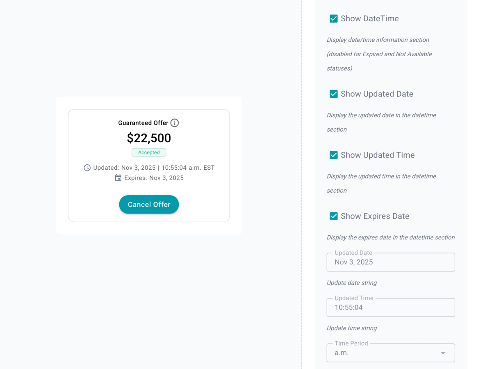

## Overview

DS-Bridge Whitelabel is a proof of concept that became an operating model. It demonstrates how product, design, and development can work in a single shared system to move from idea to production-ready code in days instead of months. The core innovation is not the components themselves, but a secure, AI-enabled workflow that allows non-technical contributors to build, validate, and document real UI directly in the codebase.

## The Problem

Design system work relied heavily on static Figma files and manual documentation:

- Files became bloated, difficult to maintain, and rarely referenced outside design
- Engineers spent significant time translating intent instead of refining solutions
- Iteration cycles stretched from weeks into months, limiting speed and confidence
- No consistent standard for how deeply components should be documented
- Documentation drift between design intent and implementation

## What Changed

- Replaced static documentation with a **living, executable source of truth**
- Introduced a demo-first, two-phase workflow that validates behavior before documentation
- Enabled non-technical designers to work safely in real code using structured AI workflows
- Automated planning, documentation, and knowledge capture within existing security constraints

## Strategy and Approach

**Core strategy:** Lower the barrier to building real software so that anyone can act as a *director of creative execution*, not just a contributor, by replacing manual documentation with executable, shared truth.

### Two-Phase Workflow

1. **Demo First** - Build and validate interactive component behavior
2. **Document Second** - Capture patterns and rationale only after validation

This approach ensures documentation reflects reality, not aspiration.

### Enabling Non-Technical Contributors

Created session-based systems that:
- Scoped work into manageable phases
- Guided execution with clear decision points
- Automatically captured decisions and propagated to documentation hubs
- Made the system usable by designers, product owners, and future contributors

## Impact

- **Reduced design-to-development validation cycles from months to days**
- Enabled a junior designer with no coding background to independently ship a production component in under one week
- Improved handoff quality by delivering engineers validated, state-complete components
- Created a scalable model that product owners, designers, and developers can all use

## Why This Matters

- Increases organizational velocity without increasing headcount
- Shifts engineering time from repetitive implementation to high-leverage refinement
- Creates a repeatable, auditable process aligned with enterprise security standards
- Positions the design system as a company-wide platform, not a design-only artifact

## What This Enables Next

- Faster validation of product ideas in real code
- Broader participation from designers, product owners, and junior contributors
- Reduced reliance on third-party tooling
- A foundation for scaling AI-assisted development across teams

---

*Due to the confidential nature of this work, specific implementation details and proprietary tooling are limited.*
